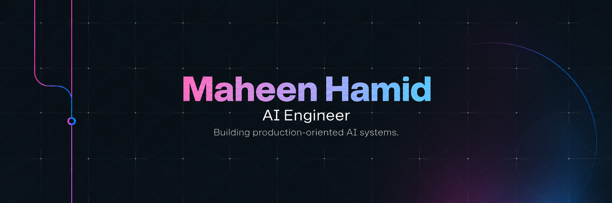

  

━━━━━━━━━━ ABOUT ME ━━━━━━━━━━

Short introduction                    Animated AI GIF
What you build                        / coding sticker
Current focus

━━━━━━━━━━ CURRENTLY BUILDING ━━━━━━━━━━

🔭 RAG Evaluation / Optimization
🧠 Agentic AI
⚙️ Production AI Systems
📊 Evaluation Infrastructure

━━━━━━━━━━ 🛠 MY TOOLBOX ━━━━━━━━━━

👩‍💻 Languages
[Python] [TypeScript] [JavaScript] [...]

🧠 AI / LLM Engineering
[RAG] [LangChain] [LangGraph]
[Embeddings] [Vector Search] [...]

🧰 Frameworks & Libraries
[FastAPI] [React] [Next.js] [...]

🗄 Databases & Vector Stores
[PostgreSQL] [Redis] [Qdrant]

☁️ Infrastructure / DevOps
[Docker] [GitHub Actions] [...]

💻 Software & Tools
[VS Code] [Git] [GitHub]
[Postman] [Linux] [...]

━━━━━━━━━━ 🚀 FEATURED PROJECTS ━━━━━━━━━━

      [animated / styled project cards]

RAG Evaluation Harness
Another flagship project
Future project

━━━━━━━━━━ 📊 GITHUB ANALYTICS ━━━━━━━━━━

       🔥 Animated Streak Card

[ GitHub Stats ]      [ Top Languages ]

━━━━━━━━━━ 📈 ACTIVITY ━━━━━━━━━━

    Full-width animated activity graph

━━━━━━━━━━ 🐍 CONTRIBUTIONS ━━━━━━━━━━

       animated snake eating
       contribution squares

━━━━━━━━━━ 3D CONTRIBUTIONS ━━━━━━━━━━

       3D contribution calendar

━━━━━━━━━━ ⚡ RECENT ACTIVITY ━━━━━━━━━━

Automatically updated:
⚡ pushed...
✨ opened PR...
📝 committed...
⭐ contributed...

━━━━━━━━━━━━━━━━━━━━━━━━━━━━━━━━━━━━━━

         Animated gradient footer
      Thanks for visiting ✨

━━━━━━━━━━━━━━━━━━━━━━━━━━━━━━━━━━━━━━
👩‍💻 Programming Languages

 Python   TypeScript   JavaScript   HTML   CSS

🧠 AI & LLM Engineering

 RAG   LangChain   LangGraph   Embeddings
 Vector Search   LLM APIs

🧰 Frameworks & Libraries

 FastAPI   React   Next.js

🗄 Databases & Storage

 PostgreSQL   Redis   Qdrant

⚙️ DevOps & Infrastructure

 Docker   GitHub Actions   REST APIs

💻 Software & Development Tools

 VS Code   Git   GitHub   Postman   Linux
